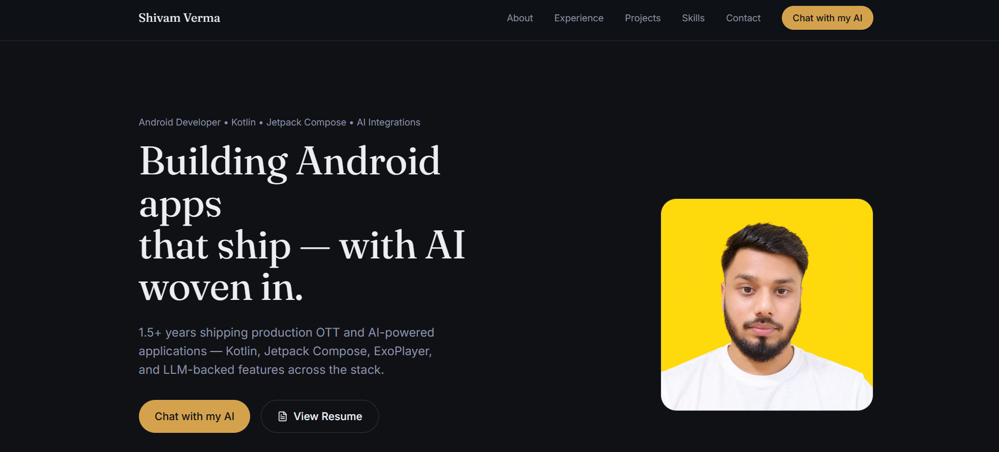
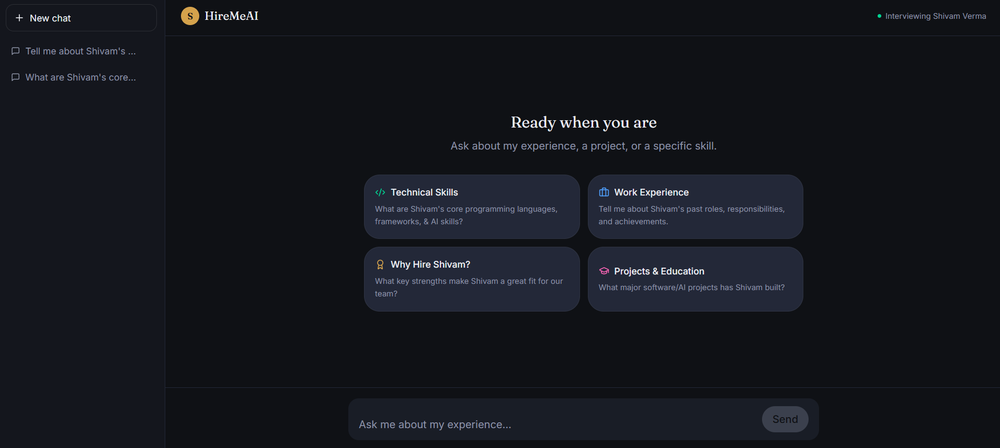

# HireMeAI - Interactive AI Portfolio

My personal portfolio site — with an AI chatbot that lets recruiters and interviewers ask questions about me directly and get grounded, resume-accurate answers, instead of just reading a static page.

🔗 **Live:** [hiremeai-shivamverma.vercel.app](https://hiremeai-shivamverma.vercel.app/)

---

## 🚀 Features

✅ **Portfolio Site** - Projects, skills, and experience, built with React + TypeScript + Tailwind CSS.
✅ **AI Recruiter Chat** - Ask the chatbot anything about me ("What's his notice period?", "What are his strengths?", "Tell me about the ad pipeline project") and get a real, grounded answer.
✅ **Resume-Grounded Answers, Not Hallucinations** - The chatbot is restricted to my actual resume data and a self-assessment layer I wrote myself — if it doesn't know something, it says so instead of making it up.
✅ **Streaming Responses** - Answers stream in token-by-token, like a real chat experience.
✅ **Project Galleries** - Lightbox-based image/video galleries for individual projects (Yournal, SKART).

---

## 🛠️ Technologies Used

**Frontend:**
- **React 19** + **TypeScript**
- **Vite** (build tooling)
- **Tailwind CSS 4**
- **React Router**
- **Lucide / React Icons**

**Backend:**
- **FastAPI** (Python)
- **Groq API** (LLM inference — `openai/gpt-oss-20b`)
- **Pydantic** (structured resume schema + validation)
- **pypdf** (resume PDF text extraction)

---

## 📸 Screenshots

<p align="center">
  
</p>
<p align="center"><em>Home</em></p>

<p align="center">
  
</p>
<p align="center"><em>AI Chat</em></p>

---

## 📋 Setup Instructions

### 1️⃣ Clone the Repository

```bash
git clone https://github.com/ShivamVerma19/hiremeai.git
```

### 2️⃣ Backend Setup

```bash
cd backend
# add a .env file with:
# GROQ_API_KEY=your_key_here
uv sync          # or: pip install -r requirements.txt
python build_resume_cache.py   # parses the resume PDF into resume_data.json (run once)
uvicorn main:app --reload
```

### 3️⃣ Frontend Setup

```bash
cd frontend
npm install
npm run dev
```

---

## 🔗 How It Works

### Resume Parsing (Done Once, Cached)

- `build_resume_cache.py` reads the resume PDF, sends it to an LLM with a strict JSON schema (`Resume` / `Experience` / `SelfAssessment` Pydantic models), and writes the structured result to `resume_data.json`.
- This means resume parsing happens **once, offline** — not on every chat request — so the live chat endpoint is fast and doesn't burn LLM calls re-parsing the same PDF.

### The Self-Assessment Layer

- Beyond raw resume facts, I wrote a `SelfAssessment` block directly in code — strengths, weaknesses, "why hire me," career goals, how I handle pressure, etc. — the kind of answers a resume alone can't give but an interviewer will actually ask.

### Grounded, Third-Person Chat

- `ask_candidate_stream()` builds a system prompt that: (1) instructs the model to speak **about** me in third person, never impersonate me as "I"; (2) restricts answers strictly to the resume JSON and self-assessment fields; (3) explicitly tells it to say it doesn't know rather than invent an answer; (4) keeps responses short and conversational, no markdown formatting — so it reads like an actual spoken answer, not a bullet-point dump.
- Responses stream back via FastAPI's `StreamingResponse`, token by token, from the Groq API.

---

## 🔥 Future Enhancements

✅ Let visitors download a tailored one-page summary based on their chat questions.
✅ Add analytics on which questions get asked most, to know what recruiters actually care about.
✅ Expand the self-assessment layer as more interview experience accumulates.

---

## 💡 Contributors

**Shivam Verma** - [GitHub](https://github.com/ShivamVerma19) - [Portfolio](https://hiremeai-shivamverma.vercel.app/)
